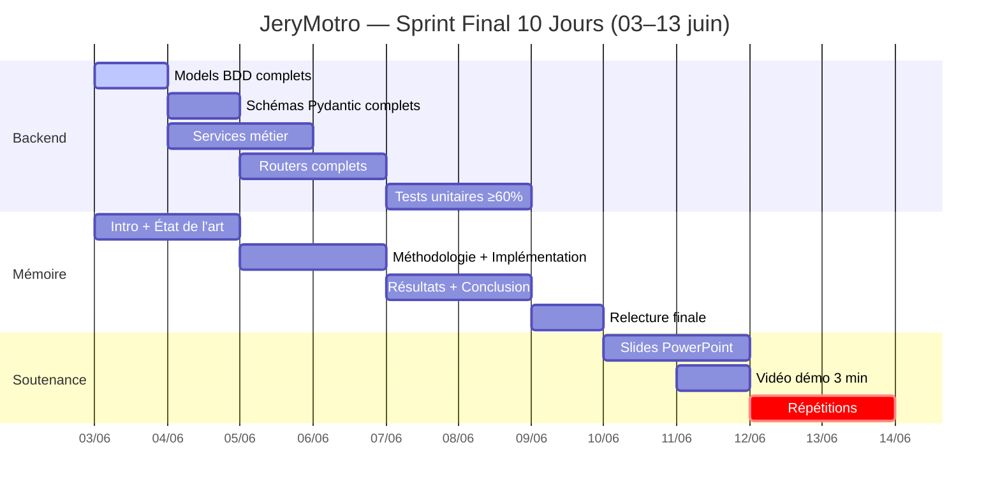

# 🗓️ Plan de Développement — JeryMotro Backend
#JeryMotro #MemoireL3 #Planning #Sprint

> **Période :** 03/06/2026 → 13/06/2026 — **Sprint final 10 jours**  
> **Contexte :** Auth ✅ · Zones ✅ · Docs à jour ✅ · Modèles ML externes · Vertex AI
> **Objectif :** Backend prod-ready, tests couverts, mémoire rédigé, soutenance prête

---

## 📊 ÉTAT ACTUEL (03/06/2026)

| Composant | Statut | Avancement |
|-----------|--------|------------|
| Conception (5 docs) | ✅ Terminé | 100% |
| Auth + JWT + Rôles | ✅ Terminé | 100% |
| Modèle `User` SQLAlchemy | ✅ Terminé | 100% |
| Modèle `MonitoredZone` SQLAlchemy | ✅ Terminé | 100% |
| Router `zones.py` (Premium) | ✅ Terminé | 100% |
| `.env.example` + `requirements.txt` | ✅ Terminé | 100% |
| Service ML externe (`jerymotronet_service.py`) | ✅ Conception | Code à implémenter |
| Service RAG (`rag_service.py` Vertex AI) | ✅ Conception | Code à implémenter |
| Service Alertes (`alert_service.py`) | ✅ Conception | Code à implémenter |
| Service FIRMS (`firms_service.py`) | ✅ Conception | Code à implémenter |
| Models BDD complets (Detection, FireEvent, Alert…) | ⬜ À faire | 10% (stubs) |
| Schémas Pydantic complets | ⬜ À faire | 15% (stubs) |
| Routers complets (detections, clusters, chat, alerts) | ⬜ À faire | 10% (stubs) |
| Tests unitaires ≥ 60% | ⬜ À faire | 0% |
| **Mémoire L3** | 🔄 En cours | ~15% |
| Présentation soutenance | ⬜ À faire | 0% |

---

## 📅 GANTT — VUE D'ENSEMBLE (03→13 juin)



---

## 🔴 BLOC 1 — Models & Schémas complets (03–04 juin)

> **Objectif :** Remplacer tous les stubs par les vraies implémentations de la conception

### 03 juin — Models BDD

- [ ] **`models/detection.py`** — `FirmsFireDetection` (lat, lon, brightness, frp, acq_date, satellite, confidence, cluster_id…)
- [ ] **`models/cluster.py`** — `FireEvent` (statut ACTIVE/COOLING/LIKELY_OUT/UNKNOWN, centroid, risk_score, frp_total…)
- [ ] **`models/prediction.py`** — `Prediction` (grid_cell_id, risk_score, confidence, prediction_date, model_used…)
- [ ] **`models/alert.py`** — `Alert` (user_id, channel, fire_event_id, message, sent_at…)
- [ ] **`models/alert_subscription.py`** — `AlertSubscription` (user_id, channel, min_risk, min_frp, enabled…)
- [ ] Mettre à jour `models/__init__.py` pour exporter tous les modèles
- [ ] Vérifier que `Base.metadata.create_all` crée toutes les tables au démarrage

**⭐ Livrable :** Toutes tables créées par `uvicorn api.main:app --reload`

---

### 04 juin — Schémas Pydantic + Services métier

**Schémas :**
- [ ] **`schemas/detection.py`** — `DetectionResponse` (tous champs BDD + risk_level calculé)
- [ ] **`schemas/cluster.py`** — `FireEventResponse` + `FireStatusEnum`
- [ ] **`schemas/prediction.py`** — `PredictionResponse` + `RiskMapResponse` (GeoJSON)
- [ ] **`schemas/alert.py`** — `AlertResponse`, `AlertCreate`, `AlertTriggerRequest`
- [ ] **`schemas/user.py`** — compléter `UserUpdate` (contacts Premium)

**Services métier (squelette fonctionnel) :**
- [ ] **`services/jerymotronet_service.py`** — client HTTP vers service ML externe (tel que défini dans la conception)
- [ ] **`services/rag_service.py`** — Vertex AI (Gemini 1.5 Flash) + ChromaDB
- [ ] **`services/alert_service.py`** — SMTP email + Twilio WhatsApp/SMS
- [ ] **`services/firms_service.py`** — fetch FIRMS CSV + parsing

**⭐ Livrable :** Tous schémas validables + services importables sans erreur

---

## 🟠 BLOC 2 — Routers complets (05–06 juin)

> **Objectif :** Tous les endpoints de la conception retournent de vraies données

### 05 juin — Routers publics (Visiteur)

- [ ] **`routers/detections.py`** — `GET /detections` (filtres: date, bbox, min_risk), `GET /detections/{id}`, `GET /detections/stats/daily`
- [ ] **`routers/clusters.py`** — `GET /clusters` (filtres: statut, region), `GET /clusters/{id}`, `GET /clusters/{id}/detections`
- [ ] **`routers/predictions.py`** — `GET /predictions/latest`, `GET /predictions/risk-map` (GeoJSON Google Maps)
- [ ] **`routers/chat.py`** — `POST /chat` (RAG Vertex AI, avec `zone_id` optionnel Premium)

### 06 juin — Routers authentifiés

- [ ] **`routers/alerts.py`** — `GET /alerts/me`, `POST /alerts/subscribe`, `DELETE /alerts/subscribe/{id}`, `POST /alerts/trigger` (Admin)
- [ ] Brancher `alert_service.py` sur `POST /alerts/trigger`
- [ ] Ajouter le router `zones.py` dans `main.py` (déjà créé ✅, vérifier les dépendances)
- [ ] Endpoint interne `POST /internal/process-firms` (déclenche collecte + inférence ML)

**⭐ Livrable :** Swagger UI complet, tous les endpoints documentés et fonctionnels

---

## 🟡 BLOC 3 — Tests unitaires (07–08 juin)

> **Cible : couverture ≥ 60%** (exigence mémoire L3)

### 07 juin — Tests Auth + Détections + Clusters

```
api/tests/
├── conftest.py           # fixtures DB SQLite in-memory + client ASGI
├── test_auth.py          # register, login, me, profile, delete
├── test_detections.py    # GET /detections (public), filtres, stats
└── test_clusters.py      # GET /clusters, statut feu
```

- [ ] `conftest.py` — base SQLite en mémoire + `AsyncClient` ASGI
- [ ] `test_auth.py` — 8 cas (register, login, duplicate, me, update, contacts, delete, token_expired)
- [ ] `test_detections.py` — 4 cas (liste, filtre date, filtre bbox, stats)
- [ ] `test_clusters.py` — 3 cas (liste, filtre statut, détections d'un cluster)

### 08 juin — Tests Chat + Alertes + Zones

```
├── test_chat.py          # POST /chat (mock Vertex AI)
├── test_alerts.py        # subscribe, trigger, me
└── test_zones.py         # CRUD zones Premium (mock Premium user)
```

- [ ] `test_chat.py` — 3 cas (message valide, hors contexte, avec zone_id Premium)
- [ ] `test_alerts.py` — 4 cas (subscribe email, subscribe WhatsApp→403 Standard, trigger, me)
- [ ] `test_zones.py` — 4 cas (create, list, delete, 403 Standard)
- [ ] Lancer `pytest api/tests/ --cov=api --cov-report=term` → vérifier ≥ 60%

**⭐ Livrable :** `pytest` vert, couverture ≥ 60%, rapport affiché

---

## 🟢 BLOC 4 — Mémoire L3 (03–09 juin, en parallèle)

> **Structure cible : ~60–80 pages** · Rédiger en parallèle chaque soir

| Jour | Chapitres | Objectif pages |
|------|-----------|----------------|
| **03 juin** | Introduction + Contexte Madagascar | 5–6 p |
| **04 juin** | État de l'art (FIRMS, ML/DL, RAG, FastAPI) | 8–10 p |
| **05 juin** | Méthodologie — Architecture + Pipeline | 10–12 p |
| **06 juin** | Méthodologie — JeryMotroNet (ML externe + Vertex AI) | 8–10 p |
| **07 juin** | Implémentation — FastAPI, Auth, Zones, Alertes | 10–12 p |
| **08 juin** | Résultats & Évaluation — métriques, captures Swagger | 8–10 p |
| **09 juin** | Discussion + Conclusion + Bibliographie + Relecture | 6–8 p |

**⭐ Livrable 09/06 :** Mémoire PDF ~ 60 p, relu, bibliographie IEEE complète

---

## 🎤 BLOC 5 — Soutenance (10–13 juin)

### 10–11 juin — Slides PowerPoint

- [ ] **Slide 1–3 :** Page de garde · Contexte · Problématique
- [ ] **Slide 4–6 :** Architecture globale · Stack technologique · Rôles utilisateurs
- [ ] **Slide 7–9 :** Pipeline données (FIRMS → GEE → ML externe → BDD)
- [ ] **Slide 10–12 :** JeryMotroNet (services ML + Vertex AI RAG) · Alertes
- [ ] **Slide 13–14 :** Demo captures (Swagger, Google Maps, Chat IA, Zone Premium)
- [ ] **Slide 15–17 :** Résultats & Métriques · Discussion · Conclusion & Perspectives

### 11 juin — Vidéo démo (3 min)

- [ ] Scénario : Visiteur voit la carte → Standard reçoit alerte email → Premium configure une zone + interroge l'agent IA
- [ ] Enregistrement écran (OBS ou Loom)
- [ ] Sous-titres ou voix off

### 12–13 juin — Répétitions

- [ ] Répétition chrono (15 min max)
- [ ] Préparer réponses aux questions jury
- [ ] Vérifier que la démo fonctionne en live (`uvicorn api.main:app`)

---

## ✅ CHECKLIST LIVRABLES FINAUX

| # | Livrable | Date cible | Statut |
|---|----------|------------|--------|
| L1 | Conception docs (5 fichiers) à jour | 03/06 | ✅ |
| L2 | Models BDD complets | 03/06 | ⬜ |
| L3 | Services métier (ML ext + Vertex AI + Alertes) | 04/06 | ⬜ |
| L4 | Routers complets + Swagger UI | 06/06 | ⬜ |
| L5 | Tests pytest ≥ 60% couverture | 08/06 | ⬜ |
| L6 | **Mémoire L3 PDF** (~60 p) | 09/06 | ⬜ |
| L7 | Slides PowerPoint (15–17 slides) | 11/06 | ⬜ |
| L8 | Vidéo démo 3 min (MP4) | 11/06 | ⬜ |
| L9 | Répétitions soutenance | 12–13/06 | ⬜ |

---

## ⚠️ RÈGLES DU SPRINT FINAL

> 1. **Priorité absolue :** Mémoire > Tests > Routers complets > Chat IA > ConvLSTM
> 2. **ML externe :** Ne pas perdre de temps à entraîner des modèles — le service ML est **externe**, un stub HTTP est suffisant pour la démo si le service n'est pas prêt
> 3. **Vertex AI RAG :** Mock acceptable en test (`unittest.mock`) — l'intégration réelle peut se faire en J6
> 4. **Mémoire :** Rédiger **chaque soir** même si le code n'est pas fini — utiliser les conceptions docs comme source
> 5. **`.env` :** Ne jamais committer le fichier `.env` — seul `.env.example` va dans Git

---

**Créé le :** 03/06/2026 | **Mise à jour :** 03/06/2026 | **Projet :** JeryMotro Platform L3  
**Encadrante :** RANDRIAMIARISON Zilga Heritiana
