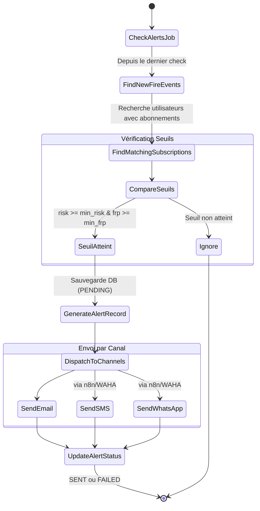

```mermaid
stateDiagram-v2
    [*] --> CheckAlertsJob
    CheckAlertsJob --> FindNewFireEvents : Depuis le dernier check
    FindNewFireEvents --> FindMatchingSubscriptions : Recherche utilisateurs avec abonnements
    
    state "Vérification Seuils" as CheckSeuils {
        FindMatchingSubscriptions --> CompareSeuils
        CompareSeuils --> SeuilAtteint : risk >= min_risk & frp >= min_frp
        CompareSeuils --> Ignore : Seuil non atteint
    }
    
    SeuilAtteint --> GenerateAlertRecord : Sauvegarde DB (PENDING)
    GenerateAlertRecord --> DispatchToChannels
    
    state "Envoi par Canal" as Dispatch {
        DispatchToChannels --> SendEmail
        DispatchToChannels --> SendSMS : via n8n/WAHA
        DispatchToChannels --> SendWhatsApp : via n8n/WAHA
    }
    
    SendEmail --> UpdateAlertStatus
    SendSMS --> UpdateAlertStatus
    SendWhatsApp --> UpdateAlertStatus
    
    UpdateAlertStatus --> [*] : SENT ou FAILED
    Ignore --> [*]
```
