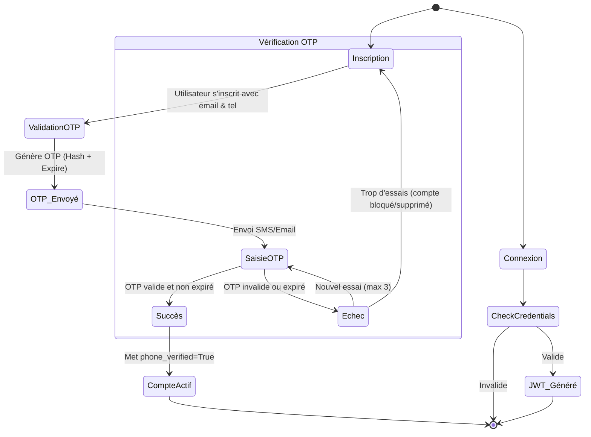

```mermaid
stateDiagram-v2
    [*] --> Inscription
    Inscription --> ValidationOTP : Utilisateur s'inscrit avec email & tel
    ValidationOTP --> OTP_Envoyé : Génère OTP (Hash + Expire)
    OTP_Envoyé --> SaisieOTP : Envoi SMS/Email
    
    state "Vérification OTP" as Verif {
        SaisieOTP --> Succès : OTP valide et non expiré
        SaisieOTP --> Echec : OTP invalide ou expiré
        Echec --> SaisieOTP : Nouvel essai (max 3)
        Echec --> Inscription : Trop d'essais (compte bloqué/supprimé)
    }
    
    Succès --> CompteActif : Met phone_verified=True
    CompteActif --> [*]
    
    [*] --> Connexion
    Connexion --> CheckCredentials
    CheckCredentials --> JWT_Généré : Valide
    CheckCredentials --> [*] : Invalide
    JWT_Généré --> [*]
```
