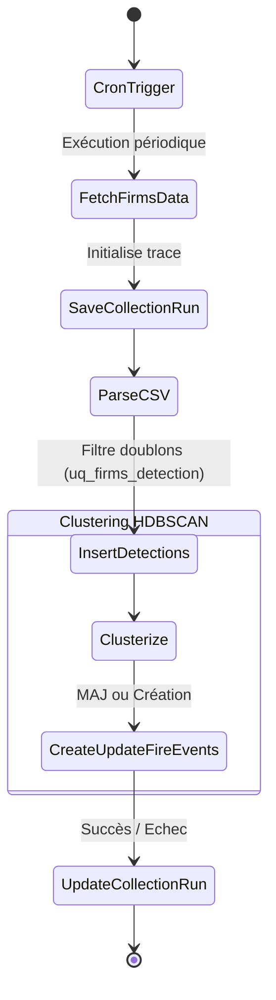

```mermaid
stateDiagram-v2
    [*] --> CronTrigger
    CronTrigger --> FetchFirmsData : Exécution périodique
    FetchFirmsData --> SaveCollectionRun : Initialise trace
    SaveCollectionRun --> ParseCSV
    ParseCSV --> InsertDetections : Filtre doublons (uq_firms_detection)
    
    state "Clustering HDBSCAN" as Clustering {
        InsertDetections --> Clusterize
        Clusterize --> CreateUpdateFireEvents : MAJ ou Création
    }
    
    CreateUpdateFireEvents --> UpdateCollectionRun : Succès / Echec
    UpdateCollectionRun --> [*]
```
