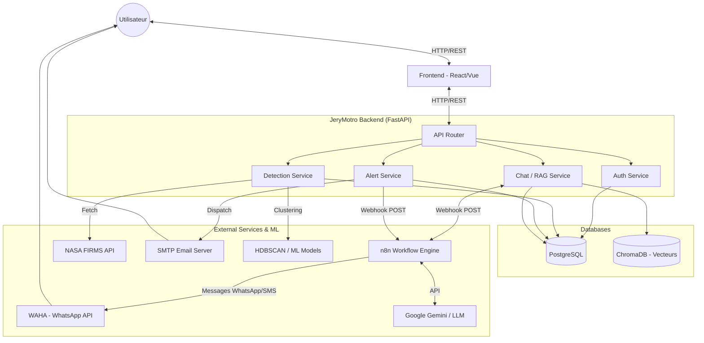

```mermaid
flowchart TD
    %% Utilisateurs et interfaces
    User((Utilisateur))
    Frontend[Frontend - React/Vue]
    
    %% Backend
    subgraph "JeryMotro Backend (FastAPI)"
        API[API Router]
        AuthSvc[Auth Service]
        DetectSvc[Detection Service]
        AlertSvc[Alert Service]
        ChatSvc[Chat / RAG Service]
    end
    
    %% Bases de données
    subgraph "Databases"
        PostgreSQL[(PostgreSQL)]
        ChromaDB[(ChromaDB - Vecteurs)]
    end
    
    %% Services Externes & Orchestration
    subgraph "External Services & ML"
        n8n[n8n Workflow Engine]
        FIRMS[NASA FIRMS API]
        WAHA[WAHA - WhatsApp API]
        LLM[Google Gemini / LLM]
        SMTP[SMTP Email Server]
        Hdbscan[HDBSCAN / ML Models]
    end
    
    %% Connexions
    User <-->|HTTP/REST| Frontend
    Frontend <-->|HTTP/REST| API
    
    API --> AuthSvc
    API --> DetectSvc
    API --> AlertSvc
    API --> ChatSvc
    
    AuthSvc --> PostgreSQL
    DetectSvc --> PostgreSQL
    AlertSvc --> PostgreSQL
    
    DetectSvc -->|Fetch| FIRMS
    DetectSvc -->|Clustering| Hdbscan
    
    ChatSvc --> ChromaDB
    ChatSvc --> PostgreSQL
    ChatSvc <-->|Webhook POST| n8n
    
    n8n <-->|API| LLM
    
    AlertSvc -->|Dispatch| SMTP
    AlertSvc -->|Webhook POST| n8n
    n8n -->|Messages WhatsApp/SMS| WAHA
    WAHA --> User
    SMTP --> User
```
