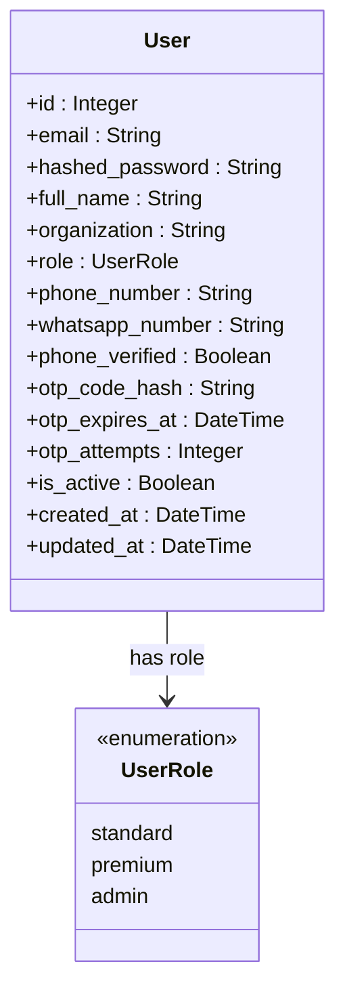

```mermaid
classDiagram
    class User {
        +id : Integer
        +email : String
        +hashed_password : String
        +full_name : String
        +organization : String
        +role : UserRole
        +phone_number : String
        +whatsapp_number : String
        +phone_verified : Boolean
        +otp_code_hash : String
        +otp_expires_at : DateTime
        +otp_attempts : Integer
        +is_active : Boolean
        +created_at : DateTime
        +updated_at : DateTime
    }

    class UserRole {
        <<enumeration>>
        standard
        premium
        admin
    }

    User --> UserRole : has role
```
