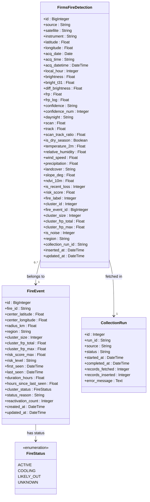

```mermaid
classDiagram
    class FirmsFireDetection {
        +id : BigInteger
        +source : String
        +satellite : String
        +instrument : String
        +latitude : Float
        +longitude : Float
        +acq_date : Date
        +acq_time : String
        +acq_datetime : DateTime
        +local_hour : Integer
        +brightness : Float
        +bright_t31 : Float
        +diff_brightness : Float
        +frp : Float
        +frp_log : Float
        +confidence : String
        +confidence_num : Integer
        +daynight : String
        +scan : Float
        +track : Float
        +scan_track_ratio : Float
        +is_dry_season : Boolean
        +temperature_2m : Float
        +relative_humidity : Float
        +wind_speed : Float
        +precipitation : Float
        +landcover : String
        +slope_deg : Float
        +ndvi_10m : Float
        +is_recent_loss : Integer
        +risk_score : Float
        +fire_label : Integer
        +cluster_id : Integer
        +fire_event_id : BigInteger
        +cluster_size : Integer
        +cluster_frp_total : Float
        +cluster_frp_max : Float
        +is_noise : Integer
        +region : String
        +collection_run_id : String
        +inserted_at : DateTime
        +updated_at : DateTime
    }

    class FireEvent {
        +id : BigInteger
        +fire_id : String
        +center_latitude : Float
        +center_longitude : Float
        +radius_km : Float
        +region : String
        +cluster_size : Integer
        +cluster_frp_total : Float
        +cluster_frp_max : Float
        +risk_score_max : Float
        +risk_level : String
        +first_seen : DateTime
        +last_seen : DateTime
        +duration_hours : Float
        +hours_since_last_seen : Float
        +cluster_status : FireStatus
        +status_reason : String
        +reactivation_count : Integer
        +created_at : DateTime
        +updated_at : DateTime
    }

    class FireStatus {
        <<enumeration>>
        ACTIVE
        COOLING
        LIKELY_OUT
        UNKNOWN
    }

    class CollectionRun {
        +id : Integer
        +run_id : String
        +source : String
        +status : String
        +started_at : DateTime
        +completed_at : DateTime
        +records_fetched : Integer
        +records_inserted : Integer
        +error_message : Text
    }

    FireEvent --> FireStatus : has status
    FirmsFireDetection "0..*" --> "1" FireEvent : belongs to
    FirmsFireDetection "0..*" --> "1" CollectionRun : fetched in
```
