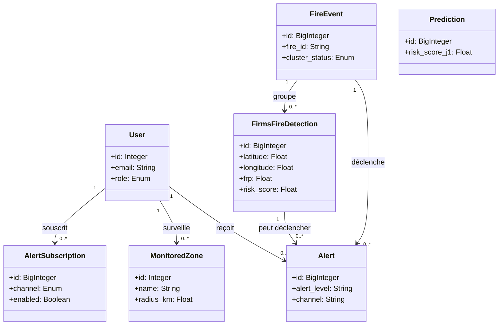

```mermaid
classDiagram
    %% Vue d'ensemble simplifiée des relations principales

    class User {
        +id: Integer
        +email: String
        +role: Enum
    }

    class FirmsFireDetection {
        +id: BigInteger
        +latitude: Float
        +longitude: Float
        +frp: Float
        +risk_score: Float
    }

    class FireEvent {
        +id: BigInteger
        +fire_id: String
        +cluster_status: Enum
    }

    class Alert {
        +id: BigInteger
        +alert_level: String
        +channel: String
    }

    class AlertSubscription {
        +id: BigInteger
        +channel: Enum
        +enabled: Boolean
    }

    class MonitoredZone {
        +id: Integer
        +name: String
        +radius_km: Float
    }

    class Prediction {
        +id: BigInteger
        +risk_score_j1: Float
    }

    %% Relations
    User "1" --> "0..*" AlertSubscription : souscrit
    User "1" --> "0..*" MonitoredZone : surveille
    User "1" --> "0..*" Alert : reçoit
    FireEvent "1" --> "0..*" FirmsFireDetection : groupe
    FireEvent "1" --> "0..*" Alert : déclenche
    FirmsFireDetection "1" --> "0..*" Alert : peut déclencher
```
