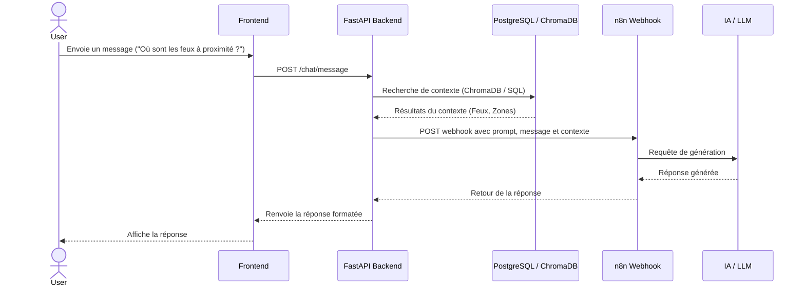

```mermaid
sequenceDiagram
    actor User
    participant Frontend
    participant Backend as FastAPI Backend
    participant DB as PostgreSQL / ChromaDB
    participant n8n as n8n Webhook
    participant LLM as IA / LLM

    User->>Frontend: Envoie un message ("Où sont les feux à proximité ?")
    Frontend->>Backend: POST /chat/message
    Backend->>DB: Recherche de contexte (ChromaDB / SQL)
    DB-->>Backend: Résultats du contexte (Feux, Zones)
    Backend->>n8n: POST webhook avec prompt, message et contexte
    n8n->>LLM: Requête de génération
    LLM-->>n8n: Réponse générée
    n8n-->>Backend: Retour de la réponse
    Backend-->>Frontend: Renvoie la réponse formatée
    Frontend-->>User: Affiche la réponse
```
