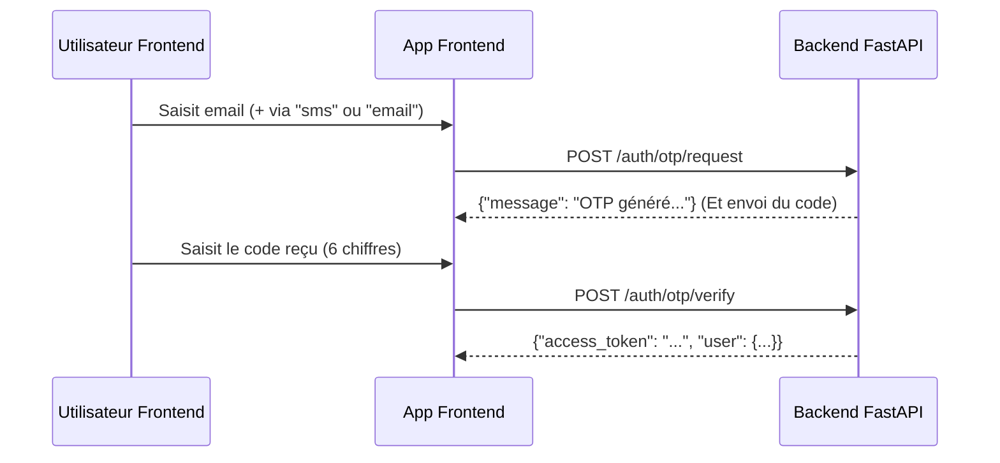

# 📱 Guide d'Intégration Frontend — JeryMotro

Ce guide technique décrit l'architecture logique, les flux utilisateur, les structures de données, et les modalités d'intégration avec l'API FastAPI de **JeryMotro** pour l'équipe de développement Frontend (Web/Mobile).

---

## 📋 Table des Matières

1. [Configuration Globale](#1-configuration-globale)
2. [Gestion des Rôles & Permissions](#2-gestion-des-rôles--permissions)
3. [Flux d'Authentification & OTP](#3-flux-dauthentification--otp)
4. [Carte Interactive (Détections & Clusters)](#4-carte-interactive-détections--clusters)
5. [Carte de Prédiction (Couche GeoJSON)](#5-carte-de-prédiction-couche-geojson)
6. [Système d'Alertes & Abonnements](#6-système-dalertes--abonnements)
7. [Zones Prioritaires de Surveillance (Premium)](#7-zones-prioritaires-de-surveillance-premium)
8. [Chatbot IA RAG (JeryMotro AI)](#8-chatbot-ia-rag-jerymotro-ai)
9. [Tableau de Bord Administrateur (Pipeline)](#9-tableau-de-bord-administrateur-pipeline)
10. [Gestion des Erreurs & Codes HTTP](#10-gestion-des-erreurs--codes-http)
11. [Exemples de Code d'Intégration (Axios & Google Maps)](#11-exemples-de-code-dintégration-axios--google-maps)

---

## 1. Configuration Globale

### 1.1 Base URLs

- **Développement local :** `http://localhost:8200`
- **Production (IP Directe) :** `http://35.192.27.164/jerymotro-api`
- **Production (Domaine - à venir) :** `https://jerymotro-api.duckdns.org`
- **Documentation OpenAPI (Swagger) :** `/docs` (ex: `http://localhost:8200/docs` ou `http://35.192.27.164/jerymotro-api/docs`)
- **Documentation ReDoc :** `/redoc`
- **Health Check :** `GET /health` → `{"status":"ok","message":"JeryMotro API is running"}`

### 1.2 Headers Communs

Pour toutes les requêtes authentifiées, vous devez inclure le token JWT sous cette forme :

```http
Authorization: Bearer <votre_token_jwt>
Content-Type: application/json
```

### 1.3 Comptes de test réels

Les comptes suivants sont seedés dans la base pour les tests et l'intégration. Ils utilisent tous le mot de passe `password123`.

| Rôle     | Email                                    | Usage recommandé                       |
| -------- | ---------------------------------------- | -------------------------------------- |
| Admin    | `randriamanantenatsikynyantsa@gmail.com` | API admin / internal / trigger alertes |
| Premium  | `tkabeleon@gmail.com`                    | Zones premium, alertes WhatsApp/SMS    |
| Premium  | `rtsikynyantsa@gmail.com`                | Zones premium, alertes WhatsApp/SMS    |
| Standard | `tsikynyantsa1@outlook.fr`               | Flow utilisateur standard              |
| Standard | `tsikynyantsa2@outlook.fr`               | Flow utilisateur standard              |
| Standard | `tsikynyantsa3@outlook.fr`               | Flow utilisateur standard              |
| Standard | `tsikynyantsa4@outlook.fr`               | Flow utilisateur standard              |

> Utilisez ces comptes pour valider les flux `login`, `me`, les abonnements d'alertes et les routes premium/admin sans recréer de compte à chaque test.

---

## 2. Gestion des Rôles & Permissions

Le frontend doit adapter dynamiquement ses vues et actions selon le rôle de l'utilisateur stocké dans le profil (`user.role`) :

| Rôle         | Libellé UI          | Canaux d'Alertes           | Fonctionnalités Cartographiques & IA                     |
| ------------ | ------------------- | -------------------------- | -------------------------------------------------------- |
| **Visiteur** | Grand Public        | Aucun                      | Carte publique, filtres détections, chat IA général      |
| **Standard** | Utilisateur Gratuit | `EMAIL` uniquement         | Carte publique, filtres détections, chat IA général      |
| **Premium**  | Partenaire / ONG    | `EMAIL`, `SMS`, `WHATSAPP` | + Gestion des **Zones Prioritaires** et prompts de zones |
| **Admin**    | Administration      | Tous                       | + Déclenchement d'alertes manuel, gestion globale        |

---

## 3. Flux d'Authentification & OTP

### 3.1 Inscription (Standard par défaut)

- **Endpoint :** `POST /auth/register`
- **Payload :**
  ```json
  {
    "email": "user@test.mg",
    "password": "SecurePassword123!",
    "full_name": "Jean Rakoto",
    "organization": "ONG Tanety"
  }
  ```
- **Réponse (201 Created) :**
  ```json
  {
    "access_token": "eyJ0eXAiOiJKV1Qi...",
    "token_type": "bearer",
    "user": {
      "id": 1,
      "email": "user@test.mg",
      "full_name": "Jean Rakoto",
      "organization": "ONG Tanety",
      "role": "standard",
      "is_active": true
    }
  }
  ```

### 3.2 Connexion Standard (OAuth2 / Password)

- **Endpoint :** `POST /auth/login`
- **Payload :**
  ```json
  {
    "email": "user@test.mg",
    "password": "SecurePassword123!"
  }
  ```
- **Réponse (200 OK) :** Retourne le même modèle que l'inscription.

### 3.3 Authentification sans mot de passe / OTP (SMS ou Email)

Ce flux permet une connexion rapide ou la validation d'un contact téléphonique.



#### Flux technique :

1. **Étape 1 : Demande de code**
   - **Endpoint :** `POST /auth/otp/request`
   - **Payload :** `{"email": "user@test.mg", "via": "sms"}` (ou `"email"`)
2. **Étape 2 : Saisie & Soumission**
   - **Endpoint :** `POST /auth/otp/verify`
   - **Payload :** `{"email": "user@test.mg", "code": "123456"}`
   - **Réponse :** Token JWT d'accès si validé.

### 3.4 Gestion du Profil

- **Obtenir mon profil :** `GET /auth/me`
- **Mettre à jour mes informations :** `PUT /auth/me/profile` (`full_name`, `organization`)
- **Mettre à jour mes numéros d'alertes :** `PUT /auth/me/contacts`
  ```json
  {
    "phone_number": "+261320000000",
    "whatsapp_number": "+261320000000"
  }
  ```
- **Supprimer mon compte :** `DELETE /auth/me` (Afficher une boîte de dialogue de confirmation stricte).

---

## 4. Carte Interactive (Détections & Clusters)

### 4.1 Récupération des détections individuelles

- **Endpoint :** `GET /detections`
- **Paramètres Query utiles :**
  - `date_from` / `date_to` : Format `YYYY-MM-DD`
  - `min_frp` / `max_frp` : Puissance radiative en MW
  - `min_risk` / `max_risk` : Score de danger ML (0.0 à 1.0)
  - `region` : Filtre par région de Madagascar (ex: `Menabe`, `Diana`)
  - `exclude_noise` : `true` par défaut (exclut les points aberrants)
  - `limit` (défaut `1000`) & `offset` (pagination)
- **Logique d'affichage et couleurs :**
  Utilisez la clé `risk_level` renvoyée par l'API pour colorer les marqueurs sur la carte :
  - `CRITICAL` 🔴 Rouge clignotant
  - `HIGH` 🟠 Orange foncé
  - `MEDIUM` 🟡 Jaune/Orange
  - `LOW` 🟢 Vert

### 4.2 Représentation des Clusters (FireEvents)

Pour éviter de saturer le navigateur avec des milliers de marqueurs individuels, affichez les clusters de feux.

- **Endpoint :** `GET /clusters` (Filtres possibles : `cluster_status` [`ACTIVE`, `COOLING`, `LIKELY_OUT`], `region`).
- **Rendu visuel :** Affichez un marqueur de cluster avec le badge `cluster_size` (nombre de feux dans le cluster).
- **Popup de détail :** Au clic sur un cluster, affichez un panneau avec :
  - `duration_hours` (durée de combustion)
  - `cluster_frp_total` (intensité cumulée)
  - `risk_level` (niveau de risque du cluster)
  - Un bouton "Afficher les points" qui appelle `GET /clusters/{id}/detections` pour dessiner les foyers précis constituant le cluster.

### 4.3 Graphique d'historique (Dashboard)

- **Endpoint :** `GET /detections/stats/daily` (Filtres `date_from` et `date_to`).
- **Format de données :**
  ```json
  {
    "stats": [
      {
        "date": "2026-06-03",
        "total_detections": 12,
        "high_risk_count": 3,
        "avg_frp": 25.5,
        "max_frp": 45.0,
        "regions_affected": ["Menabe"]
      }
    ]
  }
  ```
- **Rendu :** Courbe temporelle du nombre de détections et histogramme superposé pour les feux à haut risque.

---

## 5. Carte de Prédiction (Couche GeoJSON)

JeryMotroNet ConvLSTM calcule quotidiennement les risques de feux à J+1 sur Madagascar sous forme de grille.

- **Endpoint :** `GET /predictions/risk-map?min_risk=0.4`
- **Structure GeoJSON retournée :**
  ```json
  {
    "type": "FeatureCollection",
    "features": [
      {
        "type": "Feature",
        "geometry": {
          "type": "Point",
          "coordinates": [44.58, -18.25]
        },
        "properties": {
          "risk_score_j1": 0.76,
          "grid_cell_id": "123",
          "region": "Menabe"
        }
      }
    ],
    "metadata": {
      "prediction_date": "2026-06-04",
      "total_cells": 1024,
      "high_risk_cells": 87,
      "model_version": "xgboost-v1"
    }
  }
  ```
- **Rendu cartographique :**
  Utilisez l'opacité et un dégradé de couleur (du jaune `0.4` au rouge foncé `1.0`) selon la valeur de `properties.risk_score_j1`.

---

## 6. Système d'Alertes & Abonnements

### 6.1 S'abonner aux alertes

L'utilisateur configure ses critères d'alerte :

- **Endpoint :** `POST /alerts/subscribe`
- **Payload :**
  ```json
  {
    "channel": "EMAIL", // "EMAIL", "SMS", "WHATSAPP"
    "destination": "destinataire@test.mg", // Email ou numéro de téléphone
    "min_risk": 0.7, // Déclencher si risque >= 70%
    "min_frp": 30.0 // Déclencher si FRP >= 30 MW
  }
  ```

### 6.2 Historique personnel d'alertes

- **Endpoint :** `GET /alerts/me`
- **Rendu :** Liste chronologique avec état de distribution (`SENT`, `FAILED`, `PENDING`).

---

## 7. Zones Prioritaires de Surveillance (Premium)

Les comptes Premium peuvent définir des polygones ou des cercles de surveillance intensive.

- **Visualiser mes zones :** `GET /zones/` (Dessiner des cercles sur la carte en utilisant `latitude`, `longitude` et `radius_km`).
- **Créer une zone :** `POST /zones/`
  ```json
  {
    "name": "Réserve de Menabe",
    "latitude": -19.5,
    "longitude": 44.5,
    "radius_km": 20.0,
    "min_risk": 0.6,
    "min_frp": 30.0,
    "custom_ai_prompt": "Tu es l'agent de garde de la réserve de Menabe..."
  }
  ```
- **Supprimer une zone :** `DELETE /zones/{id}`

---

## 8. Chatbot IA RAG (JeryMotro AI)

Le volet Chatbot permet de poser des questions naturelles sur les feux et prédictions.

- **Endpoint :** `POST /chat`
- **Payload :**
  ```json
  {
    "message": "Fais-moi un résumé de la situation dans le Menabe.",
    "temperature": 0.1,
    "zone_id": null // Passer l'ID de zone si ouvert depuis une Zone Prioritaire
  }
  ```
- **Format de réponse :**
  ```json
  {
    "response": "### Situation dans le Menabe\n...\n",
    "sources": ["Cluster #5", "Document NASA FIRMS"],
    "data_context": {
      "regions_mentioned": ["Menabe"]
    },
    "model_used": "gemini-1.5-flash",
    "response_time_ms": 1200
  }
  ```
- **Logique UI :**
  - Rendre `response` en Markdown propre.
  - Afficher la liste des `sources` sous forme de badges cliquables.

---

## 9. Tableau de Bord Administrateur (Pipeline)

L'interface Admin doit permettre de lancer des tâches de fond pour le traitement de la donnée.

### 9.1 Synchronisation des Détections (NASA FIRMS)
- **Endpoint :** `POST /internal/process-firms`
- **Action :** Télécharge les dernières données satellitaires et les enregistre en base.
- **Réponse :** Résumé des lignes ajoutées (`row_count`).

### 9.2 Re-calcul des Clusters (Spatial)
- **Endpoint :** `POST /internal/rebuild-clusters?limit=50000`
- **Important :** Étant donné le très grand volume de données (historique > 2.4 millions de lignes), le clustering HDBSCAN doit être exécuté par **lots (batches)**. Le paramètre `limit` par défaut est `50000`. L'interface d'administration doit appeler cet endpoint en boucle jusqu'à ce que la réponse indique `"processed_detections": 0` ou un statut similaire signifiant la fin du traitement.

### 9.3 Scoring ML (Risque d'Incendie)
- **Endpoint :** `POST /internal/run-scoring?limit=1000`
- **Action :** Fait appel au modèle ML (JeryMotroNet) pour attribuer un `risk_score` aux nouvelles détections. À appeler de façon asynchrone dans le dashboard.

---

## 10. Gestion des Erreurs & Codes HTTP

L'API FastAPI renvoie des codes HTTP standard et des détails explicites en cas d'erreur. Les erreurs de validation de schéma renvoient un code `422`.

| Code HTTP             | Description                                     | Action conseillée côté Frontend                                                |
| --------------------- | ----------------------------------------------- | ------------------------------------------------------------------------------ |
| **401 Unauthorized**  | Token manquant, invalide ou expiré.             | Déconnecter l'utilisateur, vider le stockage local et rediriger vers `/login`. |
| **403 Forbidden**     | Droits insuffisants (ex: accès Premium requis). | Afficher une modale proposant de s'abonner à l'offre Premium.                  |
| **404 Not Found**     | Élément recherché introuvable.                  | Afficher une erreur 404 ciblée ou rediriger vers la liste parente.             |
| **422 Unprocessable** | Format de données incorrect (Pydantic).         | Afficher les messages d'erreurs précis près des champs du formulaire.          |
| **500 Server Error**  | Erreur interne du serveur ou timeout.           | Afficher un message générique "Service momentanément indisponible".            |

---

## 11. Exemples de Code d'Intégration (Axios & Google Maps)

### 11.1 Axios Client avec gestion du Token et de la déconnexion sur 401

```javascript
import axios from "axios";

const api = axios.create({
  baseURL: process.env.REACT_APP_API_URL || "https://api.jerymotro.app",
  headers: {
    "Content-Type": "application/json",
  },
});

// Injection automatique du token
api.interceptors.request.use(
  (config) => {
    const token = localStorage.getItem("jerymotro_token");
    if (token) {
      config.headers.Authorization = `Bearer ${token}`;
    }
    return config;
  },
  (error) => Promise.reject(error),
);

// Interception des erreurs de session
api.interceptors.response.use(
  (response) => response,
  (error) => {
    if (error.response && error.response.status === 401) {
      localStorage.removeItem("jerymotro_token");
      window.location.href = "/login?expired=true";
    }
    return Promise.reject(error);
  },
);

export default api;
```

### 11.2 Exemple d'affichage GeoJSON Predictions (Google Maps API)

```javascript
function initPredictionMap(map, geojsonData) {
  // Charge la couche GeoJSON dans Google Maps
  map.data.addGeoJson(geojsonData);

  // Style dynamique selon le risque ConvLSTM
  map.data.setStyle((feature) => {
    const risk = feature.getProperty("risk_score_j1") || 0;

    // Dégradé : Jaune -> Orange -> Rouge
    let color = "#34d399"; // Vert par défaut (bas risque)
    if (risk >= 0.8)
      color = "#ef4444"; // Rouge
    else if (risk >= 0.6)
      color = "#f97316"; // Orange
    else if (risk >= 0.4) color = "#facc15"; // Jaune

    return {
      icon: {
        path: google.maps.SymbolPath.CIRCLE,
        fillColor: color,
        fillOpacity: risk * 0.8, // Opacité selon l'intensité
        scale: 8,
        strokeColor: "#ffffff",
        strokeWeight: 1,
      },
    };
  });
}
```
