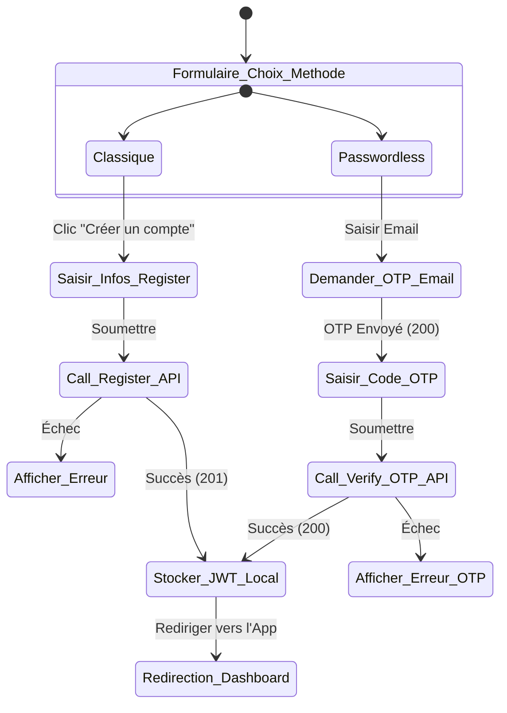

# Guide d'Intégration Frontend — Inscription et Authentification

Ce guide complet est destiné à l'équipe frontend pour intégrer facilement l'authentification et l'inscription des utilisateurs sur l'application **JeryMotro**. Le backend prend en charge deux méthodes d'inscription/connexion :
1. **L'authentification classique** (E-mail et Mot de passe).
2. **L'authentification sans mot de passe** (OTP via Email ou SMS).

---

## 🔑 1. Méthode 1 : Inscription & Connexion Classique

Cette méthode est recommandée pour les utilisateurs préférant un mot de passe persistant.

### 📝 A. Inscription d'un nouvel utilisateur
* **Endpoint** : `POST /auth/register`
* **Type d'envoi** : `application/json`
* **Payload attendu** :
```json
{
  "email": "user@example.com",
  "password": "un_mot_de_passe_securise_min_8_cars",
  "full_name": "Jean Dupont",
  "organization": "ONG Tanety" // Optionnel
}
```

* **Réponse de succès (`201 Created`)** :
```json
{
  "access_token": "eyJhbGciOiJIUzI1NiIsIn...",
  "token_type": "bearer",
  "user": {
    "id": 194,
    "email": "user@example.com",
    "full_name": "Jean Dupont",
    "organization": "ONG Tanety",
    "role": "standard",
    "is_active": true,
    "phone_number": null,
    "whatsapp_number": null,
    "phone_verified": false
  }
}
```
> [!TIP]
> Stockez immédiatement l' `access_token` dans votre state-manager (Redux/Pinia/Zustand) et dans le `localStorage` ou `SecureStore` (pour le mobile). Vous devez l'ajouter au header `Authorization` pour tous les appels futurs nécessitant d'être authentifié :
> `Authorization: Bearer <votre_token>`

* **Erreurs fréquentes** :
  * `400 Bad Request` : Email déjà utilisé (`"L'email est déjà utilisé"`) ou format d'email invalide.
  * `422 Unprocessable Entity` : Mot de passe inférieur à 8 caractères ou nom inférieur à 3 caractères.

---

### 🔑 B. Connexion Classique
* **Endpoint** : `POST /auth/login`
* **Payload attendu** :
```json
{
  "email": "user@example.com",
  "password": "un_mot_de_passe_securise_min_8_cars"
}
```
* **Réponse de succès (`200 OK`)** : Identique à la réponse d'inscription (contient le token JWT et le profil de l'utilisateur).

---

## ⚡ 2. Méthode 2 : Authentification sans Mot de passe (OTP)

Cette méthode permet de s'inscrire ou de se connecter instantanément en saisissant uniquement son adresse e-mail. Si l'adresse e-mail n'existe pas encore en base, **le compte est créé automatiquement** à la volée.

### 📱 Étape A : Demande d'OTP
* **Endpoint** : `POST /auth/otp/request`
* **Payload attendu** :
```json
{
  "email": "user@example.com",
  "via": "email" // "email" ou "sms"
}
```
> [!IMPORTANT]
> Pour utiliser l'option `via: "sms"`, l'utilisateur doit déjà avoir configuré son numéro de téléphone sur son compte. Pour une première inscription, utilisez obligatoirement `via: "email"`.

* **Réponse attendue (`200 OK`)** :
```json
{
  "message": "OTP généré et tentative d'envoi effectuée"
}
```
*(Note : En environnement de développement, la clé `"otp"` en clair peut être renvoyée dans la réponse JSON pour faciliter les tests automatisés).*

---

### 🔑 Étape B : Validation de l'OTP
Une fois que l'utilisateur a reçu le code de 6 chiffres, il doit le saisir sur l'interface pour finaliser sa connexion/inscription.

* **Endpoint** : `POST /auth/otp/verify`
* **Payload attendu** :
```json
{
  "email": "user@example.com",
  "code": "851295" // Code OTP reçu de 6 caractères
}
```

* **Réponse de succès (`200 OK`)** :
```json
{
  "access_token": "eyJhbGciOiJIUzI1NiIsIn...",
  "token_type": "bearer",
  "user": {
    "id": 194,
    "email": "user@example.com",
    "full_name": null,
    "organization": null,
    "role": "standard",
    "is_active": true,
    "phone_number": null,
    "whatsapp_number": null,
    "phone_verified": false
  }
}
```

---

## 👤 3. Gestion du Profil et Coordonnées de Contact (Authentifié)

Une fois connecté, le token doit être inclus dans l'entête : `Authorization: Bearer <token>`.

### 📝 A. Récupérer mon profil
* **Endpoint** : `GET /auth/me`
* **Headers** : `Authorization: Bearer <token>`
* **Réponse de succès (`200 OK`)** : Renvoie le profil utilisateur complet.

### ⚙️ B. Mettre à jour les informations de profil (Nom, Organisation)
* **Endpoint** : `PUT /auth/me/profile`
* **Headers** : `Authorization: Bearer <token>`
* **Payload** :
```json
{
  "full_name": "Jean Dupont",
  "organization": "ONG Tanety"
}
```

### 📞 C. Mettre à jour les numéros de contact (SMS et WhatsApp)
Ces coordonnées sont cruciales pour le système d'abonnements d'alertes aux feux de brousse.

* **Endpoint** : `PUT /auth/me/contacts`
* **Headers** : `Authorization: Bearer <token>`
* **Payload** :
```json
{
  "phone_number": "+261348604617", // Format international requis
  "whatsapp_number": "+261348604617" 
}
```
* **Réponse de succès (`200 OK`)** : Profil mis à jour.

---

## 🚪 4. Suppression de Compte

Pour des raisons d'éthique et de conformité RGPD/protection des données, l'utilisateur connecté peut supprimer définitivement son compte et toutes ses données associées (abonnements, alertes reçues, zones surveillées).

* **Endpoint** : `DELETE /auth/me`
* **Headers** : `Authorization: Bearer <token>`
* **Réponse attendue (`204 No Content`)** : Succès.

---

## 🧭 5. Diagramme d'état recommandé pour l'UX Frontend


