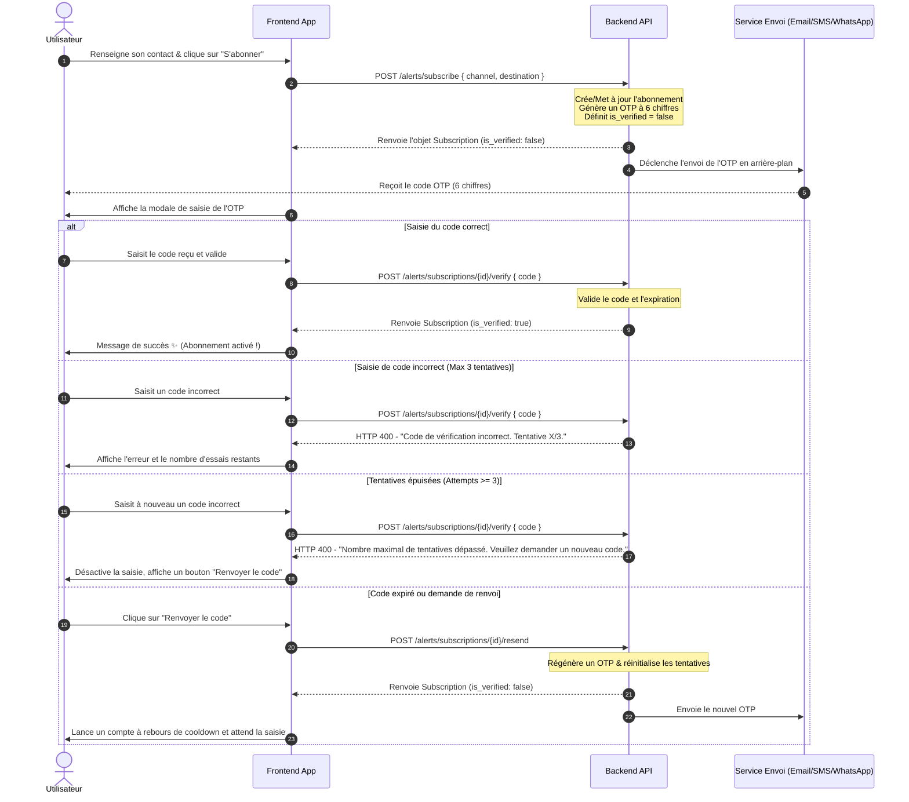

# 🛡️ Guide d'Intégration Frontend : Vérification des Abonnements aux Alertes

Ce document est destiné à l'équipe **Frontend** pour mettre en place la vérification par code unique (OTP) des abonnements d'alertes (**EMAIL**, **SMS**, **WHATSAPP**) sur la plateforme **JeryMotro**.

---

## 📌 1. Concept de Vérification

Pour garantir la validité des canaux de communication et éviter le spam ou les erreurs de saisie, le backend JeryMotro exige désormais que **chaque abonnement soit vérifié** avant de pouvoir recevoir des alertes de feux de forêt.

1. **Création ou modification d'abonnement** (`POST /alerts/subscribe`) :
   - L'abonnement est créé ou mis à jour avec le statut `is_verified: false`.
   - Un code OTP à **6 chiffres** est automatiquement généré et expédié au destinataire via le canal choisi (Email, SMS ou WhatsApp).
2. **Attente de validation** :
   - Le frontend doit détecter que l'abonnement n'est pas vérifié (`is_verified === false`) et proposer une interface de saisie du code OTP.
3. **Vérification** (`POST /alerts/subscriptions/{id}/verify`) :
   - L'utilisateur soumet le code. Si le code est correct, l'abonnement passe à `is_verified: true` et devient actif.
4. **Renvoi de code** (`POST /alerts/subscriptions/{id}/resend`) :
   - L'utilisateur peut demander à renvoyer un code si le précédent a expiré (validité de 5 minutes) ou n'est pas parvenu.

---

## 🔄 2. Flux d'Intégration Graphique

Voici le parcours utilisateur complet géré par le Frontend :



---

## 🛰️ 3. Spécification des Endpoints de l'API

Toutes les requêtes nécessitent l'en-tête d'authentification standard :
```http
Authorization: Bearer <votre_token_jwt>
```

### A. Créer ou Mettre à jour un abonnement
- **Route** : `POST /alerts/subscribe`
- **Body** :
  ```json
  {
    "channel": "SMS", // "EMAIL" | "SMS" | "WHATSAPP"
    "destination": "+261348604617",
    "min_risk": 0.70, // Optionnel (défaut: 0.70)
    "min_frp": 50.0  // Optionnel (défaut: 50.0)
  }
  ```
- **Réponse (`201 Created`)** :
  ```json
  {
    "id": 42,
    "channel": "SMS",
    "destination": "+261348604617",
    "enabled": true,
    "is_verified": false, // Déclenche automatiquement l'envoi de l'OTP
    "min_risk": 0.7,
    "min_frp": 50.0
  }
  ```

---

### B. Vérifier le code OTP reçu
- **Route** : `POST /alerts/subscriptions/{subscription_id}/verify`
- **Body** :
  ```json
  {
    "code": "123456"
  }
  ```
- **Réponses** :
  - **`200 OK` (Vérifié avec succès)** :
    ```json
    {
      "id": 42,
      "channel": "SMS",
      "destination": "+261348604617",
      "enabled": true,
      "is_verified": true, // Désormais validé !
      "min_risk": 0.7,
      "min_frp": 50.0
    }
    ```
  - **`400 Bad Request` (Erreur de code ou expiration)** :
    - Code erroné : `{"detail": "Code de vérification incorrect. Tentative 1/3."}`
    - Expiré (durée de validité : 5 minutes) : `{"detail": "Le code de vérification a expiré."}`
    - Tentatives dépassées (bloqué après 3 échecs) : `{"detail": "Nombre maximal de tentatives de vérification dépassé. Veuillez demander un nouveau code."}`
  - **`404 Not Found` (Abonnement introuvable)** :
    - `{"detail": "Abonnement introuvable"}`

---

### C. Renvoyer un code OTP
- **Route** : `POST /alerts/subscriptions/{subscription_id}/resend`
- **Body** : Aucun (requête vide).
- **Réponse (`200 OK`)** :
  ```json
  {
    "id": 42,
    "channel": "SMS",
    "destination": "+261348604617",
    "enabled": true,
    "is_verified": false,
    "min_risk": 0.7,
    "min_frp": 50.0
  }
  ```

---

## 🛠️ 4. Types TypeScript (Modèles)

Vous pouvez intégrer ces interfaces directement dans votre fichier de types (ex: `types/alerts.ts`) :

```typescript
export type AlertChannel = 'EMAIL' | 'SMS' | 'WHATSAPP';

export interface AlertSubscription {
  id: number;
  channel: AlertChannel;
  destination: string;
  enabled: boolean;
  is_verified: boolean;
  min_risk: number;
  min_frp: number;
}

export interface SubscribeRequest {
  channel: AlertChannel;
  destination: string;
  min_risk?: number;
  min_frp?: number;
}

export interface SubscriptionVerifyRequest {
  code: string;
}
```

---

## 💻 5. Composant React de Vérification Premium (TypeScript)

Voici un composant de dialogue moderne et élégant pour saisir le code OTP. Il est conçu avec du **Vanilla CSS** pour un look premium intégrant des effets de flou d'arrière-plan (glassmorphism), des transitions fluides et une gestion robuste des événements utilisateur (saisie unitaire, retour arrière, collage globale).

### A. Code du Composant : `SubscriptionVerificationModal.tsx`

```tsx
import React, { useState, useRef, useEffect } from 'react';
import './SubscriptionVerificationModal.css';

interface SubscriptionVerificationModalProps {
  isOpen: boolean;
  subscriptionId: number;
  channel: 'EMAIL' | 'SMS' | 'WHATSAPP';
  destination: string;
  onClose: () => void;
  onVerified: () => void;
}

export const SubscriptionVerificationModal: React.FC<SubscriptionVerificationModalProps> = ({
  isOpen,
  subscriptionId,
  channel,
  destination,
  onClose,
  onVerified,
}) => {
  const [otp, setOtp] = useState<string[]>(new Array(6).fill(''));
  const [loading, setLoading] = useState<boolean>(false);
  const [error, setError] = useState<string | null>(null);
  const [attemptsExceeded, setAttemptsExceeded] = useState<boolean>(false);
  const [cooldown, setCooldown] = useState<number>(60); // Cooldown de 60 secondes pour renvoi
  const [success, setSuccess] = useState<boolean>(false);
  
  const inputRefs = useRef<(HTMLInputElement | null)[]>([]);

  // Compte à rebours du bouton "Renvoyer"
  useEffect(() => {
    let interval: NodeJS.Timeout | null = null;
    if (cooldown > 0) {
      interval = setInterval(() => {
        setCooldown((prev) => prev - 1);
      }, 1000);
    }
    return () => {
      if (interval) clearInterval(interval);
    };
  }, [cooldown]);

  // Réinitialisation de la modale à l'ouverture
  useEffect(() => {
    if (isOpen) {
      setOtp(new Array(6).fill(''));
      setError(null);
      setAttemptsExceeded(false);
      setSuccess(false);
      setCooldown(60);
      setTimeout(() => {
        if (inputRefs.current[0]) inputRefs.current[0].focus();
      }, 150);
    }
  }, [isOpen]);

  if (!isOpen) return null;

  // Gérer la saisie unitaire de chaque case
  const handleChange = (element: HTMLInputElement, index: number) => {
    const value = element.value;
    if (isNaN(Number(value))) return; // Uniquement des chiffres

    const newOtp = [...otp];
    newOtp[index] = value.substring(value.length - 1); // Ne garder que le dernier caractère
    setOtp(newOtp);

    // Focus sur la case suivante
    if (value && index < 5 && inputRefs.current[index + 1]) {
      inputRefs.current[index + 1]?.focus();
    }
  };

  // Gérer les touches spéciales (Backspace, Flèches)
  const handleKeyDown = (e: React.KeyboardEvent<HTMLInputElement>, index: number) => {
    if (e.key === 'Backspace') {
      if (!otp[index] && index > 0 && inputRefs.current[index - 1]) {
        // Reculer le focus et effacer la case précédente
        const newOtp = [...otp];
        newOtp[index - 1] = '';
        setOtp(newOtp);
        inputRefs.current[index - 1]?.focus();
      } else {
        const newOtp = [...otp];
        newOtp[index] = '';
        setOtp(newOtp);
      }
    } else if (e.key === 'ArrowLeft' && index > 0) {
      inputRefs.current[index - 1]?.focus();
    } else if (e.key === 'ArrowRight' && index < 5) {
      inputRefs.current[index + 1]?.focus();
    }
  };

  // Gérer le copier-coller complet d'un code OTP
  const handlePaste = (e: React.ClipboardEvent<HTMLInputElement>) => {
    e.preventDefault();
    const pastedData = e.clipboardData.getData('text').trim();
    if (pastedData.length !== 6 || isNaN(Number(pastedData))) return;

    const newOtp = pastedData.split('');
    setOtp(newOtp);
    inputRefs.current[5]?.focus();
  };

  // Soumission à l'API de vérification
  const handleVerify = async (e?: React.FormEvent) => {
    if (e) e.preventDefault();
    const fullCode = otp.join('');
    if (fullCode.length !== 6) {
      setError('Veuillez saisir les 6 chiffres du code.');
      return;
    }

    setLoading(true);
    setError(null);

    try {
      const response = await fetch(`http://35.192.27.164/jerymotro-api/alerts/subscriptions/${subscriptionId}/verify`, {
        method: 'POST',
        headers: {
          'Content-Type': 'application/json',
          'Authorization': `Bearer ${localStorage.getItem('token')}`
        },
        body: JSON.stringify({ code: fullCode })
      });

      const data = await response.json();

      if (!response.ok) {
        if (data.detail && data.detail.includes('maximal')) {
          setAttemptsExceeded(true);
        }
        throw new Error(data.detail || 'Erreur lors de la vérification');
      }

      // Succès !
      setSuccess(true);
      setTimeout(() => {
        onVerified();
        onClose();
      }, 1500);

    } catch (err: any) {
      setError(err.message);
    } finally {
      setLoading(false);
    }
  };

  // Demander un nouveau code
  const handleResend = async () => {
    if (cooldown > 0) return;

    setLoading(true);
    setError(null);
    setAttemptsExceeded(false);
    setOtp(new Array(6).fill(''));

    try {
      const response = await fetch(`http://35.192.27.164/jerymotro-api/alerts/subscriptions/${subscriptionId}/resend`, {
        method: 'POST',
        headers: {
          'Content-Type': 'application/json',
          'Authorization': `Bearer ${localStorage.getItem('token')}`
        }
      });

      const data = await response.json();

      if (!response.ok) {
        throw new Error(data.detail || "Impossible de renvoyer le code.");
      }

      setCooldown(60); // Relancer le cooldown de 60s
      setError(null);
      if (inputRefs.current[0]) inputRefs.current[0].focus();

    } catch (err: any) {
      setError(err.message);
    } finally {
      setLoading(false);
    }
  };

  const getChannelIcon = () => {
    switch (channel) {
      case 'EMAIL': return '📧';
      case 'SMS': return '💬';
      case 'WHATSAPP': return '🟢';
    }
  };

  return (
    <div className="otp-modal-overlay">
      <div className="otp-modal-content">
        <button className="otp-modal-close" onClick={onClose}>&times;</button>
        
        {success ? (
          <div className="otp-success-screen">
            <div className="success-icon">✓</div>
            <h2>Abonnement Activé !</h2>
            <p>Votre canal {channel.toLowerCase()} ({destination}) est validé avec succès.</p>
          </div>
        ) : (
          <form onSubmit={handleVerify}>
            <div className="otp-header">
              <div className="channel-badge">
                {getChannelIcon()} {channel}
              </div>
              <h2>Vérification de sécurité</h2>
              <p className="otp-subtitle">
                Nous avons envoyé un code de validation temporaire à <strong>{destination}</strong>.
              </p>
            </div>

            <div className="otp-input-container">
              {otp.map((digit, index) => (
                <input
                  key={index}
                  type="text"
                  inputMode="numeric"
                  maxLength={1}
                  value={digit}
                  disabled={loading || attemptsExceeded}
                  ref={(el) => (inputRefs.current[index] = el)}
                  onChange={(e) => handleChange(e.target, index)}
                  onKeyDown={(e) => handleKeyDown(e, index)}
                  onPaste={index === 0 ? handlePaste : undefined}
                  className={`otp-box ${error ? 'otp-box-error' : ''}`}
                  autoComplete="one-time-code"
                />
              ))}
            </div>

            {error && <p className="otp-error-message">⚠️ {error}</p>}

            <div className="otp-actions">
              <button 
                type="submit" 
                className="btn-verify" 
                disabled={loading || otp.some(d => !d) || attemptsExceeded}
              >
                {loading ? 'Vérification...' : 'Valider l\'abonnement'}
              </button>

              <div className="otp-resend-container">
                <span className="resend-text">Vous n'avez pas reçu de code ? </span>
                <button
                  type="button"
                  className="btn-resend"
                  disabled={cooldown > 0 || loading}
                  onClick={handleResend}
                >
                  {cooldown > 0 ? `Renvoyer dans ${cooldown}s` : 'Renvoyer un code'}
                </button>
              </div>
            </div>
          </form>
        )}
      </div>
    </div>
  );
};
```

---

### B. Styles CSS Premium : `SubscriptionVerificationModal.css`

```css
/* Overlay flouté (Glassmorphism) */
.otp-modal-overlay {
  position: fixed;
  top: 0;
  left: 0;
  width: 100%;
  height: 100%;
  background: rgba(15, 23, 42, 0.65); /* Nuance d'ardoise sombre */
  backdrop-filter: blur(12px);
  -webkit-backdrop-filter: blur(12px);
  display: flex;
  align-items: center;
  justify-content: center;
  z-index: 1000;
  animation: fadeIn 0.3s ease-out;
}

/* Modale */
.otp-modal-content {
  background: rgba(30, 41, 59, 0.95); /* Arrière-plan foncé premium */
  border: 1px solid rgba(255, 255, 255, 0.08);
  box-shadow: 0 20px 40px rgba(0, 0, 0, 0.4), 
              inset 0 1px 1px rgba(255, 255, 255, 0.1);
  border-radius: 20px;
  width: 100%;
  max-width: 440px;
  padding: 36px 30px;
  position: relative;
  color: #f8fafc;
  font-family: 'Outfit', 'Inter', sans-serif;
  text-align: center;
  animation: slideUp 0.35s cubic-bezier(0.16, 1, 0.3, 1);
}

/* Bouton Fermer */
.otp-modal-close {
  position: absolute;
  top: 16px;
  right: 18px;
  background: none;
  border: none;
  color: #94a3b8;
  font-size: 28px;
  cursor: pointer;
  transition: color 0.2s;
}

.otp-modal-close:hover {
  color: #f8fafc;
}

/* Badge de Canal */
.channel-badge {
  display: inline-flex;
  align-items: center;
  gap: 6px;
  background: rgba(255, 255, 255, 0.05);
  border: 1px solid rgba(255, 255, 255, 0.1);
  border-radius: 99px;
  padding: 6px 14px;
  font-size: 13px;
  font-weight: 600;
  letter-spacing: 0.05em;
  color: #38bdf8; /* Couleur cyan */
  margin-bottom: 18px;
}

.otp-header h2 {
  font-size: 22px;
  margin: 0 0 10px 0;
  font-weight: 700;
  letter-spacing: -0.02em;
}

.otp-subtitle {
  font-size: 14px;
  color: #94a3b8;
  line-height: 1.5;
  margin: 0 0 28px 0;
}

.otp-subtitle strong {
  color: #f8fafc;
}

/* Conteneur des 6 inputs */
.otp-input-container {
  display: flex;
  justify-content: space-between;
  gap: 10px;
  margin-bottom: 24px;
}

/* Cases individuelles */
.otp-box {
  width: 52px;
  height: 58px;
  border: 2px solid rgba(255, 255, 255, 0.1);
  background: rgba(15, 23, 42, 0.4);
  border-radius: 12px;
  text-align: center;
  font-size: 24px;
  font-weight: 700;
  color: #ffffff;
  transition: all 0.2s cubic-bezier(0.4, 0, 0.2, 1);
}

.otp-box:focus {
  outline: none;
  border-color: #38bdf8;
  box-shadow: 0 0 0 4px rgba(56, 189, 248, 0.15);
  transform: translateY(-2px);
  background: rgba(15, 23, 42, 0.6);
}

.otp-box-error {
  border-color: #ef4444 !important;
}

.otp-box:disabled {
  opacity: 0.5;
  cursor: not-allowed;
}

/* Message d'erreur */
.otp-error-message {
  font-size: 13px;
  color: #f87171;
  background: rgba(239, 68, 68, 0.1);
  padding: 10px 14px;
  border-radius: 10px;
  border: 1px solid rgba(239, 68, 68, 0.2);
  margin-bottom: 24px;
  animation: shake 0.4s ease-in-out;
}

/* Actions */
.otp-actions {
  display: flex;
  flex-direction: column;
  gap: 16px;
}

.btn-verify {
  width: 100%;
  padding: 14px;
  border: none;
  border-radius: 12px;
  background: linear-gradient(135deg, #0284c7 0%, #0369a1 100%);
  color: white;
  font-size: 15px;
  font-weight: 600;
  cursor: pointer;
  box-shadow: 0 4px 12px rgba(2, 132, 199, 0.25);
  transition: all 0.2s;
}

.btn-verify:hover:not(:disabled) {
  transform: translateY(-1px);
  box-shadow: 0 6px 16px rgba(2, 132, 199, 0.35);
}

.btn-verify:disabled {
  background: rgba(255, 255, 255, 0.08);
  color: #64748b;
  cursor: not-allowed;
  box-shadow: none;
}

/* Section Renvoyer */
.otp-resend-container {
  font-size: 13px;
  color: #94a3b8;
}

.btn-resend {
  background: none;
  border: none;
  color: #38bdf8;
  font-weight: 600;
  cursor: pointer;
  padding: 0 4px;
  transition: color 0.15s;
}

.btn-resend:hover:not(:disabled) {
  color: #7dd3fc;
  text-decoration: underline;
}

.btn-resend:disabled {
  color: #64748b;
  cursor: not-allowed;
  text-decoration: none;
}

/* Écran de Succès */
.otp-success-screen {
  padding: 20px 0;
  display: flex;
  flex-direction: column;
  align-items: center;
  gap: 16px;
}

.success-icon {
  width: 64px;
  height: 64px;
  border-radius: 50%;
  background: rgba(34, 197, 94, 0.15);
  color: #22c55e;
  border: 2px solid #22c55e;
  display: flex;
  align-items: center;
  justify-content: center;
  font-size: 28px;
  font-weight: bold;
  animation: scalePop 0.4s cubic-bezier(0.175, 0.885, 0.32, 1.275);
}

/* Animations Keyframes */
@keyframes fadeIn {
  from { opacity: 0; }
  to { opacity: 1; }
}

@keyframes slideUp {
  from { opacity: 0; transform: translateY(20px); }
  to { opacity: 1; transform: translateY(0); }
}

@keyframes scalePop {
  from { transform: scale(0.6); opacity: 0; }
  to { transform: scale(1); opacity: 1; }
}

@keyframes shake {
  0%, 100% { transform: translateX(0); }
  25% { transform: translateX(-4px); }
  75% { transform: translateX(4px); }
}
```

---

## 💡 6. Guide UX & Bonnes Pratiques Frontend

> [!TIP]
> **Recommandations d'Implémentation :**
> - **Autofocus immédiat** : Dès que l'utilisateur clique sur "S'abonner" et reçoit la réponse du serveur avec `is_verified: false`, ouvrez la modale de validation et placez immédiatement le curseur dans le premier champ OTP.
> - **Format clavier mobile** : L'utilisation de `inputMode="numeric"` garantit l'affichage d'un pavé numérique sur iOS et Android pour une saisie rapide.
> - **Gestion du copier-coller automatique** : En capturant l'événement `onPaste` sur la première case, l'utilisateur peut copier-coller son code de validation à 6 chiffres en un seul clic ou via la suggestion de saisie automatique du clavier mobile (grâce à l'attribut `autoComplete="one-time-code"`).
> - **Persistance des états** : Si l'utilisateur quitte la page de profil/alertes avant d'avoir saisi le code, l'appel `GET /alerts/subscriptions` retournera l'abonnement avec `is_verified: false`. Affichez alors un badge rouge 🔴 **"En attente de vérification"** à côté du canal, et permettez à l'utilisateur de cliquer dessus pour rouvrir la modale et saisir le code (ou en renvoyer un).
