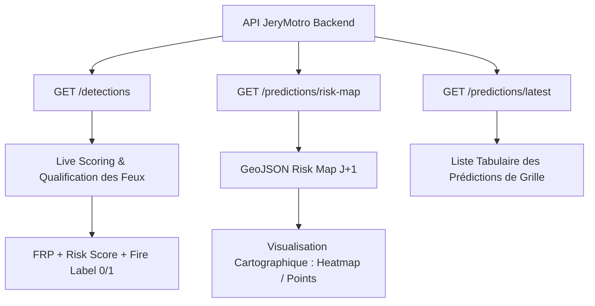

# Guide d'Intégration Frontend — Intelligence Artificielle & Prédictions

Ce guide complet est destiné à l'équipe frontend de **JeryMotro** pour intégrer l'intelligence artificielle et les prédictions de risques de feux de brousse.

Le système prédictif est divisé en deux parties :
1. **Le Machine Learning (ML) — Opérationnel & Testé** : Scoring de risque en temps réel sur les détections d'incendies et cartographie prédictive des zones à haut risque à J+1.
2. **Le Deep Learning (DL - ConvLSTM) — En cours de développement** : Modèle séquentiel temporel de propagation spatiale. Une page placeholder "Prochainement" premium doit être affichée.

---

## 🗺️ 1. Architecture Générale de la Donnée ML

Le frontend consomme les prédictions d'IA sous deux formes distinctes :



---

## ⚡ 2. Module A : Scoring des Détections en Temps Réel (Opérationnel)

Chaque détection récoltée par le satellite (NASA FIRMS) passe par notre service de Machine Learning pour évaluer sa dangerosité (score de risque) et éliminer le bruit (fausses alertes).

### 📋 Données de l'API (`GET /detections`)
Les détections retournées contiennent les attributs d'IA essentiels :
* `risk_score` (Float `[0.0 - 1.0]` ou `[0.0 - 100.0]`) : Probabilité de danger estimée.
* `fire_label` (Integer : `0` pour bruit/fausse alerte, `1` pour feu réel et avéré).
* `risk_level` (String) : Niveau de risque normalisé calculé par le serveur (`UNKNOWN`, `LOW`, `MEDIUM`, `HIGH`, `CRITICAL`).

### 🎨 Recommandations d'UI/UX pour les Badges de Risque
| Niveau de Risque (`risk_level`) | Couleur Recommandée (Hex / HSL) | Effet Premium |
| :--- | :--- | :--- |
| **CRITICAL** | Rouge `#EF4444` / `hsl(0, 84%, 60%)` | Pulsation lumineuse (`ping` animation) |
| **HIGH** | Orange `#F97316` / `hsl(24, 95%, 53%)` | Bordure d'alerte |
| **MEDIUM** | Jaune `#FACC15` / `hsl(48, 96%, 53%)` | - |
| **LOW** | Vert `#22C55E` / `hsl(142, 71%, 45%)` | - |
| **UNKNOWN** | Gris `#9CA3AF` / `hsl(220, 9%, 46%)` | - |

### 🛠️ Exemple de Composant Vue/React pour le Live Scoring
```typescript
interface Detection {
  id: number;
  latitude: number;
  longitude: number;
  frp: number;
  risk_score: number;
  risk_level: 'UNKNOWN' | 'LOW' | 'MEDIUM' | 'HIGH' | 'CRITICAL';
  fire_label: number; // 0 ou 1
}

// Fonction utilitaire pour obtenir la classe CSS du badge de risque
export function getRiskBadgeStyle(level: Detection['risk_level']): string {
  const baseClasses = "px-3 py-1 text-xs font-semibold rounded-full flex items-center gap-1.5 transition-all duration-300";
  const maps = {
    CRITICAL: "bg-red-500/10 text-red-500 border border-red-500/30 animate-pulse-glow",
    HIGH: "bg-orange-500/10 text-orange-500 border border-orange-500/30",
    MEDIUM: "bg-yellow-500/10 text-yellow-500 border border-yellow-500/30",
    LOW: "bg-green-500/10 text-green-500 border border-green-500/30",
    UNKNOWN: "bg-gray-500/10 text-gray-400 border border-gray-500/30"
  };
  return `${baseClasses} ${maps[level] || maps.UNKNOWN}`;
}
```

---

## 🗺️ 3. Module B : Carte de Risque Prédictive J+1 (Opérationnel)

Ce module permet d'afficher sous forme cartographique le niveau de risque d'incendie prédit pour le lendemain sur tout le territoire de Madagascar.

### 📋 Détail de l'API (`GET /predictions/risk-map`)
* **Paramètres de requête (Query params)** :
  * `prediction_date` (Optionnel) : Date de la prédiction (Format `YYYY-MM-DD`). Par défaut, le backend renvoie la date la plus récente disponible.
  * `min_risk` (Optionnel) : Seuil de risque minimum à retourner (entre `0.0` et `1.0`). Par défaut : `0.4`.

* **Format de Réponse** : Il s'agit d'une **FeatureCollection GeoJSON standard**, idéale pour une intégration directe avec des cartes Leaflet, Mapbox GL, ou MapLibre GL.

```json
{
  "type": "FeatureCollection",
  "features": [
    {
      "type": "Feature",
      "geometry": {
        "type": "Point",
        "coordinates": [46.42859, -19.40351]
      },
      "properties": {
        "risk_score_j1": 0.78,
        "grid_cell_id": "cell_194_46",
        "region": "Vakinankaratra"
      }
    }
  ],
  "metadata": {
    "prediction_date": "2026-06-27",
    "total_cells": 1840,
    "high_risk_cells": 342,
    "model_version": "xgb_v1.2.0"
  }
}
```

### 🗺️ Intégration Cartographique avec MapLibre GL / Mapbox GL
L'utilisation de GeoJSON permet de charger la couche de prédiction de manière extrêmement performante en tirant parti du GPU.

```javascript
import maplibregl from 'maplibre-gl';

function initRiskMap(map, predictionGeoJson) {
  // 1. Ajouter la source de données prédictive
  map.addSource('fire-risk-j1', {
    type: 'geojson',
    data: predictionGeoJson // Le JSON complet retourné par /predictions/risk-map
  });

  // 2. Ajouter une couche de heatmap ou de cercles interpolés
  map.addLayer({
    id: 'risk-heat',
    type: 'heatmap',
    source: 'fire-risk-j1',
    maxzoom: 9,
    paint: {
      // Augmenter le poids de la heatmap en fonction du score de risque
      'heatmap-weight': [
        'interpolate',
        ['linear'],
        ['get', 'risk_score_j1'],
        0, 0,
        1, 1
      ],
      // Transition de couleur : Vert (faible) -> Jaune (moyen) -> Rouge (critique)
      'heatmap-color': [
        'interpolate',
        ['linear'],
        ['heatmap-density'],
        0, 'rgba(0, 255, 0, 0)',
        0.2, 'rgba(34, 197, 94, 0.5)',
        0.5, 'rgba(250, 204, 21, 0.7)',
        0.8, 'rgba(249, 115, 22, 0.8)',
        1, 'rgba(239, 68, 68, 0.9)'
      ],
      // Ajuster le rayon en fonction du zoom
      'heatmap-radius': [
        'interpolate',
        ['linear'],
        ['zoom'],
        0, 2,
        9, 20
      ]
    }
  });
}
```

---

## 🔮 4. Module C : Deep Learning — Modélisation Temporelle (En Développement)

> [!IMPORTANT]
> **Statut : Non disponible en production.**
> Le backend prépare le modèle d'apprentissage profond de type **ConvLSTM** pour simuler la propagation spatio-temporelle continue (séquence d'expansion d'incendies). Ce travail n'étant pas finalisé, le frontend doit afficher un écran d'attente premium avec une esthétique irréprochable.

### 🎨 Recommandations UI/UX pour la section "Deep Learning" (Séquence Temporelle)

Plutôt que d'afficher une simple mention textuelle ou un écran vide, créez une page de présentation technologique ("Coming Soon" premium) contenant :
1. **Un Badge Lumineux** : Un libellé accrocheur comme `[ 🔮 IA Expérimentale - Prochainement ]`.
2. **Une Illustration Technologique** : Une grille animée ou une carte stylisée simulant une propagation abstraite (via des micro-animations CSS ou des effets canvas).
3. **Une Description Technique Valorisante** :
   > *"Notre équipe de recherche développe actuellement un modèle de réseau de neurones récurrents **ConvLSTM** (Convolutional Long Short-Term Memory). Ce modèle analysera les séries temporelles de températures, d'humidité et d'indices de végétation (NDVI) pour prédire l'expansion géométrique des feux heure par heure sur les prochaines 48 heures."*
4. **Une Visualisation d'Attente Interactive** : Une barre de chargement progressive stylisée avec un message : `[ Phase d'entraînement sur les données historiques de Madagascar en cours (82%) ]`.

### 💻 Code HTML/CSS pour le Placeholder Premium (Aesthetics Wow)
```html
<div class="dl-coming-soon-container">
  <!-- Badge d'annonce -->
  <span class="badge-experimental">PROCHAINEMENT</span>
  
  <h1 class="gradient-title">Simulation Temporelle par Deep Learning</h1>
  
  <p class="description">
    Visualisez l'évolution future et la propagation géométrique des feux de brousse à l'aide de notre modèle prédictif neuronal en cours d'entraînement.
  </p>

  <!-- Illustration animée symbolique (Grid de propagation) -->
  <div class="grid-animation-placeholder">
    <div class="pulse-node center"></div>
    <div class="pulse-node ring-1"></div>
    <div class="pulse-node ring-2"></div>
  </div>

  <!-- État de l'entraînement IA -->
  <div class="training-status-box">
    <div class="status-header">
      <span>Entraînement ConvLSTM (Madagascar)</span>
      <span class="percentage animate-pulse">82%</span>
    </div>
    <div class="progress-bar-container">
      <div class="progress-bar-fill"></div>
    </div>
    <p class="status-subtext">Optimisation des poids synaptiques sur 10 ans d'historique MODIS & VIIRS</p>
  </div>
</div>

<style>
/* CSS Styles pour correspondre au design haut de gamme JeryMotro */
.dl-coming-soon-container {
  display: flex;
  flex-direction: column;
  align-items: center;
  justify-content: center;
  text-align: center;
  padding: 3rem 1.5rem;
  background: radial-gradient(circle at top, rgba(249, 115, 22, 0.05), rgba(0, 0, 0, 0));
  border-radius: 16px;
  border: 1px solid rgba(255, 255, 255, 0.05);
}

.badge-experimental {
  background: linear-gradient(135deg, #f97316 0%, #ef4444 100%);
  color: white;
  font-size: 0.75rem;
  font-weight: 700;
  padding: 0.25rem 0.75rem;
  border-radius: 9999px;
  letter-spacing: 0.05em;
  box-shadow: 0 0 15px rgba(249, 115, 22, 0.4);
}

.gradient-title {
  font-size: 2rem;
  margin-top: 1.5rem;
  font-weight: 800;
  background: linear-gradient(to right, #ffffff, #f97316);
  -webkit-background-clip: text;
  -webkit-text-fill-color: transparent;
}

.description {
  max-width: 600px;
  color: #9ca3af;
  margin-top: 1rem;
  line-height: 1.6;
}

/* Animation Grid de propagation */
.grid-animation-placeholder {
  position: relative;
  width: 200px;
  height: 200px;
  margin: 3rem 0;
}

.pulse-node {
  position: absolute;
  top: 50%;
  left: 50%;
  transform: translate(-50%, -50%);
  border-radius: 50%;
  background: rgba(249, 115, 22, 0.2);
}

.pulse-node.center {
  width: 20px;
  height: 20px;
  background: #f97316;
  box-shadow: 0 0 20px #f97316;
}

.pulse-node.ring-1 {
  width: 70px;
  height: 70px;
  border: 1px solid rgba(249, 115, 22, 0.3);
  animation: ripple 2s infinite ease-out;
}

.pulse-node.ring-2 {
  width: 140px;
  height: 140px;
  border: 1px dashed rgba(239, 68, 68, 0.15);
  animation: ripple 3s infinite linear;
}

@keyframes ripple {
  0% {
    transform: translate(-50%, -50%) scale(0.7);
    opacity: 1;
  }
  100% {
    transform: translate(-50%, -50%) scale(1.3);
    opacity: 0;
  }
}

/* Barre d'entraînement de l'IA */
.training-status-box {
  width: 100%;
  max-width: 480px;
  background: rgba(255, 255, 255, 0.02);
  border: 1px solid rgba(255, 255, 255, 0.05);
  padding: 1.25rem;
  border-radius: 12px;
}

.status-header {
  display: flex;
  justify-content: space-between;
  font-size: 0.875rem;
  font-weight: 500;
  color: #d1d5db;
  margin-bottom: 0.5rem;
}

.status-header .percentage {
  color: #f97316;
  font-weight: 700;
}

.progress-bar-container {
  width: 100%;
  height: 6px;
  background: rgba(255, 255, 255, 0.1);
  border-radius: 9999px;
  overflow: hidden;
  margin-bottom: 0.5rem;
}

.progress-bar-fill {
  width: 82%;
  height: 100%;
  background: linear-gradient(to right, #f97316, #ef4444);
  border-radius: 9999px;
  box-shadow: 0 0 10px rgba(249, 115, 22, 0.5);
}

.status-subtext {
  font-size: 0.75rem;
  color: #6b7280;
}
</style>
```
